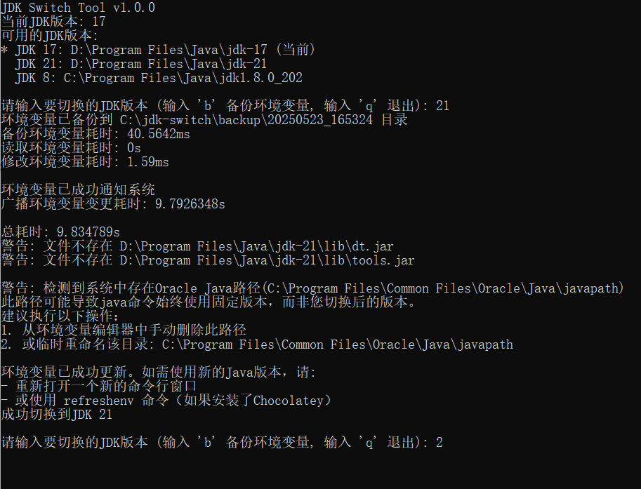

# JDK Switch Tool

A simple command-line tool for quickly switching between different JDK versions on Windows systems.

> **Note**: Over 95% of this project's code was generated with the assistance of Cursor AI.

*[中文版说明](README-zh.md)*

## Design Philosophy

This project differs from tools like SDKMan and jabba in that it does not provide functionality for automatic downloading and installation of JDK. Instead, it focuses solely on quickly switching environment variables. This is because:

- Tools like SDKMan often encounter network issues when downloading JDK, especially in mainland China
- Many developers have already manually downloaded and installed multiple versions of JDK
- This tool assumes that you have already installed the required JDK versions and only need to switch environment variables
- By focusing solely on environment variable management, the tool is more lightweight and efficient

In short, the core functionality of this tool is to quickly switch between installed JDK versions by modifying system environment variables, rather than managing JDK downloads and installations.

> **Technical Choice Note**: While implementing this functionality with batch (.bat) or PowerShell scripts might have been simpler and more direct, this project was developed in Go primarily as a learning exercise. Go provides cross-platform capabilities, better error handling, and richer functional extensibility, though it may be somewhat "overengineered" for this type of task.

## Features

- Support for switching between multiple JDK versions
- Automatic configuration of JAVA_HOME, PATH, and CLASSPATH environment variables
- Automatic backup of environment variables to ensure safe operations
- Smart cleaning of redundant Java entries in the PATH variable
- Saving the currently used JDK version
- Support for managing JDK paths through a configuration file
- Configuration file independent of the project for easy distribution and use
- Support for both command-line and interactive operations
- Detailed performance statistics
- Detection and notification of Oracle Java path issues

## Command Line Arguments

```
Usage: jdk-switch [command]

Commands:
  -init      Initialize the configuration file
  -list      List all available JDK versions
  -set <ver> Switch to the specified JDK version
  -backup    Backup current environment variables only, without switching JDK
  -v         Display version information
  -h         Display help information

Running without parameters will start interactive mode
```

## Usage

1. For first-time use, initialize the configuration file:
```bash
jdk-switch.exe -init
```
This will create a default configuration file at `C:\jdk-switch\config.json`.

2. Modify the configuration file according to your actual JDK installation paths:
```json
{
    "jdk_paths": {
        "8": "C:\\Program Files\\Java\\jdk1.8.0_301",
        "11": "C:\\Program Files\\Java\\jdk-11.0.12",
        "17": "C:\\Program Files\\Java\\jdk-17.0.2"
    },
    "current_version": "8"
}
```

3. View available JDK versions:
```bash
jdk-switch.exe -list
```

4. Switch to a specific JDK version:
```bash
jdk-switch.exe -set 11
```

5. Or use interactive mode:
```bash
jdk-switch.exe
```
Then follow the prompts to enter the JDK version number you want to switch to.

6. Backup current environment variables (can also be used as a standalone feature):
```bash
jdk-switch.exe -backup
```

## Screenshots

Below is a screenshot of the tool's interactive interface:



The tool displays the current JDK version and all available JDK versions. Users can enter a version number to switch. After completion, detailed information about environment variable modifications and time usage is displayed.

## Environment Variable Setup

The tool automatically sets the following environment variables:

1. **JAVA_HOME** - Set to the selected JDK installation path
2. **PATH** - Adds the JDK bin directory and removes other Java-related paths
3. **CLASSPATH** - Set to include the current directory (.) and common JAR files in the JDK lib directory

## Environment Variable Backup

The tool automatically creates a backup before modifying environment variables. Backup files are stored at:
```
C:\jdk-switch\backup\YYYYMMDD_HHMMSS\
```

Each backup directory contains the following files:
- PATH.txt - Backup of the PATH environment variable
- JAVA_HOME.txt - Backup of the JAVA_HOME environment variable
- CLASSPATH.txt - Backup of the CLASSPATH environment variable
- backup_info.txt - Backup summary information

## Performance Monitoring

The tool displays the execution time of each operation step, helping to identify potential performance bottlenecks:

```
Backup environment variables: 123ms
Read environment variables: 45ms
Modify environment variables: 67ms
Broadcast environment variable changes: 890ms
Total time: 1.125s
```

Note: Broadcasting environment variable changes is typically the most time-consuming operation, which is normal.

## Troubleshooting

1. **Environment variables not taking effect**
   - Try restarting the command prompt or PowerShell
   - Confirm that you have permission to modify system environment variables

2. **Oracle Java path issues**
   - If you are notified of Oracle Java path problems, follow the prompts to remove the Oracle path from PATH
   - Or temporarily rename the directory: `C:\Program Files\Common Files\Oracle\Java\javapath`

3. **Operations taking too long**
   - Check the performance data to identify bottlenecks
   - If the PATH environment variable is very long, it may affect processing speed

## Configuration File Location

The configuration file is saved by default at: `C:\jdk-switch\config.json`

## Important Notes

- The program needs to be run with administrator privileges
- Currently only supports Windows systems
- Ensure that the JDK paths in the configuration file exist
- You may need to restart the terminal for environment variable changes to take effect
- The tool automatically manages Java-related entries in the PATH environment variable
- Environment variables are automatically backed up before operations, so there's no need to worry about mistakes

## Building

```bash
# Development build
go build -o jdk-switch.exe

# Release build (reduced file size)
go build -ldflags="-s -w" -o jdk-switch.exe
```

## System Requirements

- Windows operating system
- Go 1.20 or higher (only needed for building)
- Administrator privileges (for modifying system environment variables)

## Disclaimer

**⚠️ Important: Use at your own risk**

This tool modifies system environment variables, and although we have made every effort to ensure its safety and have added automatic backup functionality, there may still be risks. The developer assumes no responsibility if any of the following issues occur after using this tool:

- System problems caused by incorrect environment variable settings
- Java applications not working properly
- PATH or other environment variables being accidentally modified or deleted
- Any other system anomalies caused by environment variable changes

Please back up your environment variables before use (this tool does this automatically) and make sure you know how to manually restore environment variables if problems occur. If you are unsure how to do this, please do not use this tool.

**Remember: The tool is provided as a convenience only; you are responsible for any issues that arise.**

## License

This project is open-sourced under the MIT License. See the [LICENSE](LICENSE) file in the project root for details. 